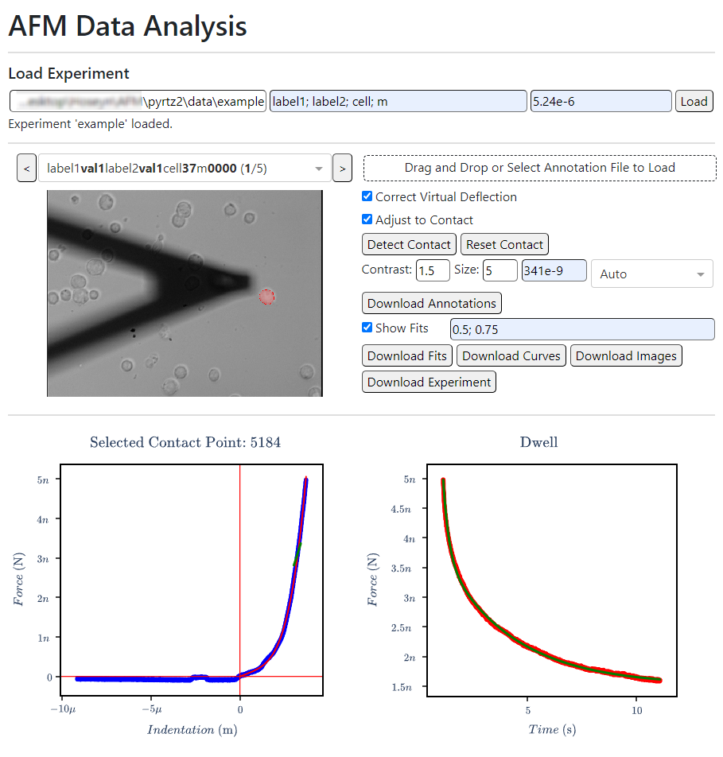

# pyrtz2

Automated analysis of AFM force curves and images via Python. Built upon its legacy version: https://github.com/nstone8/pyrtz

Developed at Georgia Institute of Technology

# Installation
pyrtz2 is on PyPI. Install using pip (Python version >= 3.11.1 is required)

```
pip install pyrtz2
```

Please see the example folder. To run the HTML dash app interface simply use:

```
from pyrtz2 import app
app.run()
```
You should see this interface:



You can select the contact point interactively. It will perform fits for approach and dwell parts of the curves using Hertzian and biexponential equations. After downloading the `csv` of fits, you can download those curves in one `pdf` file. Moreover, the user can annotate cells by the semi-auto and manual cell detection control panel. The images and the processed experiment can be downloaded at the end.
